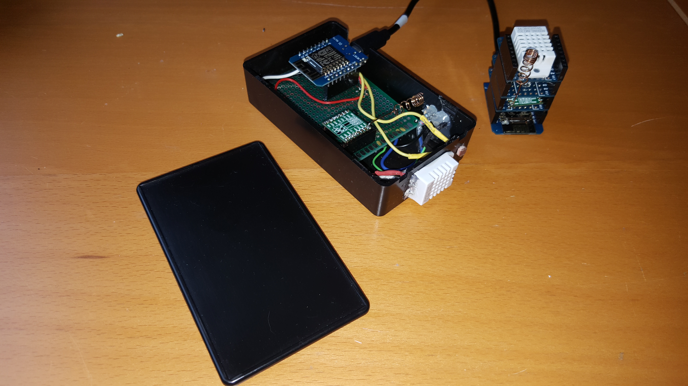
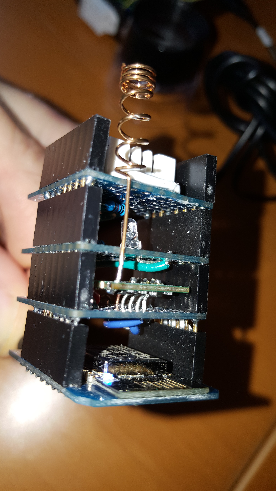
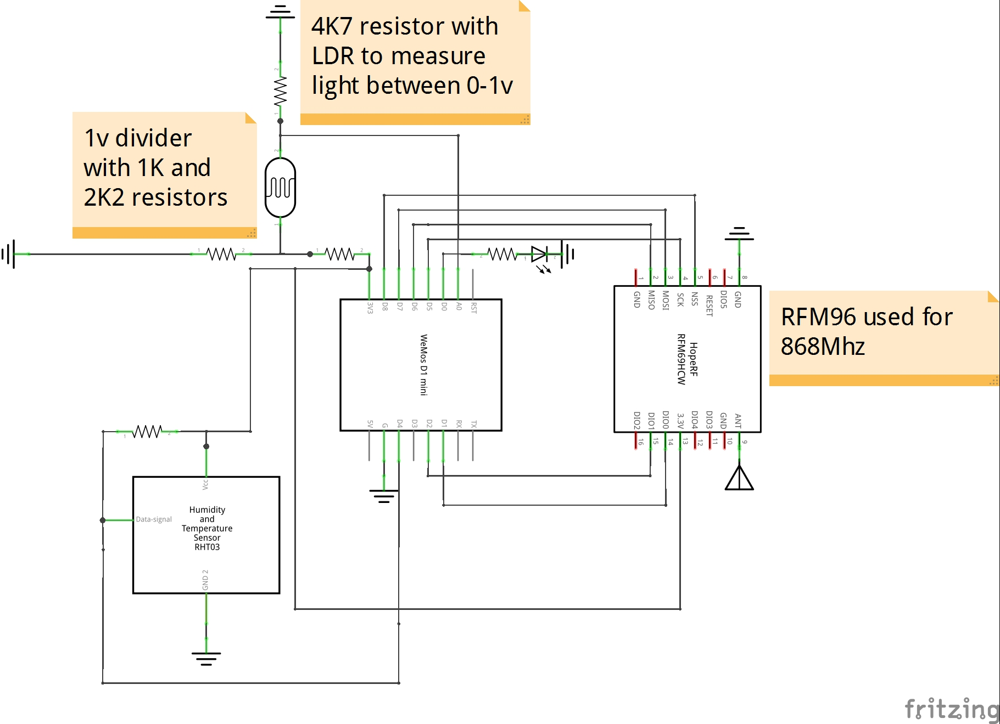

# loRaWANTTNNode

Created by Mark Troyer  -  31 December 2016

Original code from Thomas Telkamp and Matthijs Kooijman  https://github.com/matthijskooijman/arduino-lmic/

This respository explains how to build two low cost LoRaWAN devices for testing and demonstrations for under $45.  The primary benefits of this build are as follows:

- Creation of all components on a budget to quickly learn LoRaWAN and The Things Network concepts.
- Bill of Materials of less that $45 for both single node and single-channel gateway usage (software dependent)
- Ideal for basic demonstrations and POCs

In order to build the necessary 2 devices, some basic soldering skills are required.  Total build time around 3 hours.

There are two recommended ways to build these devices:  As an enclosed device or as a classic WeMOS D1 Mini stack.  Using an enclosed device has the benefit of easy and protected transportation in addition to ergonomics.   For those looking for lots of rapid prototyping, the WeMos stack direction is recommended.  Custom shields can be quickly created and tested using a modular hardware approach.

Below are the internals of an enclosed device that I use for remote demostrations.  Normally, I have 2 devices.  One acting as a Things Network gateway and the other acting as a node.

The WeMos D1 Mini Stack device on the other hand offers the ability to quickly test new hardware concepts through the use of a breadboard or custom shields.

Seperate shields can me mixed and matched for different experiements. 

Normally I order all of my parts directly though Chinese suppliers with either Ebay or AliExpress. Delivery to the Netherlands takes less than 8 work days for 80% of my orders.  Below is a Bill of Materials for this build:

- Wemos D1 Mini (ESP8266) $3-5 - The new D1 Mini pro is more expensive but adds no additional value.
- 2x Wemos D1 Mini Shields $2 - I recommend ordering at least 10 of these for prototyping if you want to go this route.
- RFM95 at 868MHz $9-12 - I order the raw modules.  It is best to order at least 3 in case one arrives DOA or you break on accidently.
- DHT22 Temperature/Humidity Sensor $4 - Order at least 2-3 of these.
- Light-Dependent Resistor $0.50 - Normaly these come in lots of 20 or more.
- Resistors: 10K, 4K7, 2K2, 1K $0.50 It is best to order an assortment of through hole resistors if you do not already have them on hand.
- 8.2cm wire antenna (nil) - I have used a coil copper antenna tuned for 868MHz.  Alternatively, an 8.2cm piece of wire will also work fine.

The hardware schematic for the build is below.   If you are building the device using a WeMos D1 Mini stack design, many of the devices connected to the WeMos process will need to be used on different proto shields.  If you are building a single channel TTN gateway, the LDR and temperature sensor can be ommited.   Keep the LED however so that you can see when LoRaWAN traffic is hitting your gateway.

Code for a single channel gateway can be found at https://github.com/things4u/ESP-1ch-Gateway-v3.0